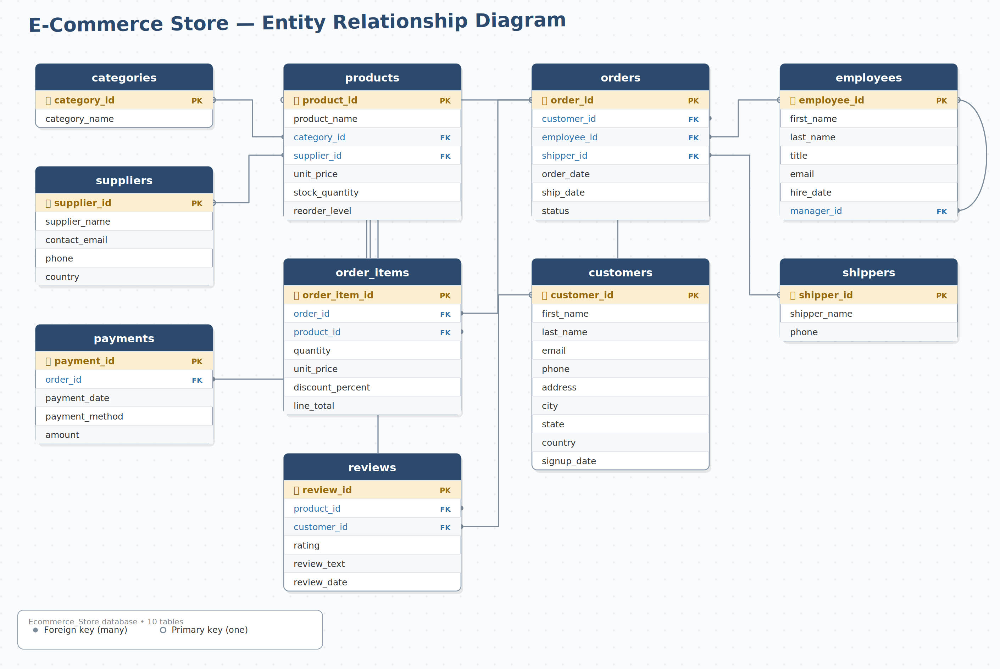

# 🛒 E-Commerce Store — SQL Analysis Project

A complete, self-contained SQL portfolio project simulating the backend
database of an e-commerce store. Includes a full relational schema, ~1,700
rows of realistic seeded data across 10 tables, a set of 19 practice
questions (Easy → Advanced) with verified answers, and ready-to-run
PostgreSQL setup files.



---

## 📌 Project Overview

This project models a small online store's operations end-to-end:
customers browsing a product catalog, placing orders, orders being
fulfilled by employees and shipped by couriers, payments being collected,
and customers leaving reviews. It was built to practice and demonstrate
SQL skills across:

- Table design & relationships (PK/FK, 1-to-many, self-referencing)
- Filtering, joins, and aggregation
- Subqueries and CTEs
- Window functions (`RANK()`, `LAG()`)
- Business/KPI reporting queries

## 🗂️ Database Schema

| Table | Rows | Description |
|---|---|---|
| `categories` | 10 | Product category master list |
| `suppliers` | 20 | Suppliers who provide products |
| `products` | 200 | Product catalog with price & stock |
| `customers` | 250 | Registered customers |
| `employees` | 18 | Staff who process orders (self-referencing `manager_id`) |
| `shippers` | 5 | Shipping/courier companies |
| `orders` | 600 | Customer orders (header info) |
| `order_items` | ~1,784 | Line items within each order |
| `payments` | ~511 | Payments made against orders |
| `reviews` | 350 | Customer product reviews & ratings |

See `Ecommerce_Store_Schema_Diagram.png` above for the full entity
relationship diagram, or `Ecommerce_Store_Create_Tables_Query_POSTGRES.sql`
for the raw DDL.

## 📁 Repository Structure

```
Ecommerce_Store_SQL_Project/
│
├── Ecommerce_Store_Schema_Diagram.png              # ER diagram
├── Ecommerce_Store_Create_Tables_Query_POSTGRES.sql # CREATE TABLE script (PostgreSQL)
├── Ecommerce_Store_Create_Tables_Query.sql          # CREATE TABLE script (generic/MySQL-style)
├── Ecommerce_Store.backup                           # pg_dump backup (schema + full data, ready to restore)
├── Query1_Complete_Data.sql                         # Full denormalized dataset (all tables joined)
├── Query2_Complete_Analysis.sql                     # One-shot business KPI summary
├── Ecommerce_SQL_Questions_and_Answers.docx         # 19 practice questions + verified answers
├── HOW_TO_LOAD_IN_PGADMIN.md                        # Step-by-step setup guide (pgAdmin)
├── CSV_Data/                                        # Raw data, one CSV per table
│   ├── categories.csv
│   ├── suppliers.csv
│   ├── products.csv
│   ├── customers.csv
│   ├── employees.csv
│   ├── shippers.csv
│   ├── orders.csv
│   ├── order_items.csv
│   ├── payments.csv
│   └── reviews.csv
└── README.md
```

## 🚀 Getting Started

### Option A — Restore the ready-made backup (fastest)
1. In pgAdmin, create an empty database (e.g. `Ecommerce_Store`).
2. Right-click it → **Restore...**
3. Format: **Custom or tar** → select `Ecommerce_Store.backup` → Restore.
4. Done — all 10 tables are created and fully populated.

### Option B — Build it from scratch
1. Create an empty database in pgAdmin.
2. Open **Query Tool** on that database and run
   `Ecommerce_Store_Create_Tables_Query_POSTGRES.sql` to create the tables.
3. Load each CSV in `CSV_Data/` into its matching table, in this order
   (parents before children):
   `categories → suppliers → products → customers → employees → shippers → orders → order_items → payments → reviews`
   — either via pgAdmin's **Import/Export Data** feature per table, or
   `psql`'s `\copy` command.

Full instructions with screenshots-style steps are in
`HOW_TO_LOAD_IN_PGADMIN.md`.

## 🔍 Example Queries

**Total revenue by category:**
```sql
SELECT c.category_name, ROUND(SUM(oi.line_total), 2) AS total_revenue
FROM order_items oi
JOIN products p ON oi.product_id = p.product_id
JOIN categories c ON p.category_id = c.category_id
GROUP BY c.category_name
ORDER BY total_revenue DESC;
```

**Top-selling product per category (window function):**
```sql
WITH product_sales AS (
    SELECT p.category_id, p.product_name, SUM(oi.quantity) AS total_qty,
           RANK() OVER (PARTITION BY p.category_id ORDER BY SUM(oi.quantity) DESC) AS rnk
    FROM order_items oi
    JOIN products p ON oi.product_id = p.product_id
    GROUP BY p.product_id
)
SELECT c.category_name, ps.product_name, ps.total_qty
FROM product_sales ps
JOIN categories c ON ps.category_id = c.category_id
WHERE ps.rnk = 1;
```

More queries — including customer retention analysis, month-over-month
revenue growth, and delivery-speed classification — are in
`Ecommerce_SQL_Questions_and_Answers.docx`.

## 📊 Key Business Metrics (from the seeded dataset)

| Metric | Value |
|---|---|
| Total Revenue | $884,160.77 |
| Total Orders | 600 |
| Average Order Value | $1,730.26 |
| Total Customers | 250 (169 repeat customers) |
| Best-Selling Category | Automotive |
| Best-Selling Product | Power Bank |
| Average Product Rating | 2.88 / 5 |

Generated by `Query2_Complete_Analysis.sql`.

## 🛠️ Tech Stack

- **PostgreSQL** — database engine
- **pgAdmin 4** — administration & query tool
- SQL features used: JOINs, GROUP BY/HAVING, subqueries, CTEs, window
  functions (`RANK`, `LAG`), CASE expressions, date arithmetic
